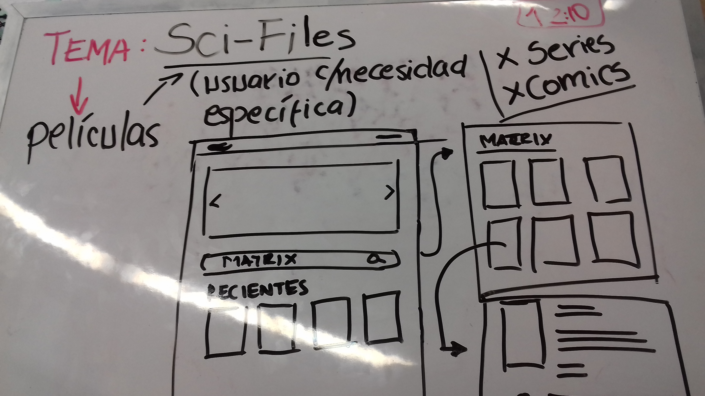
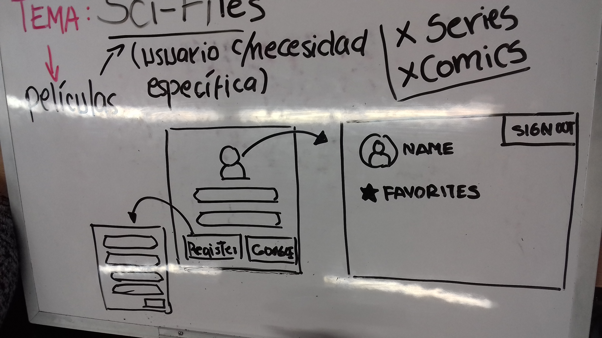
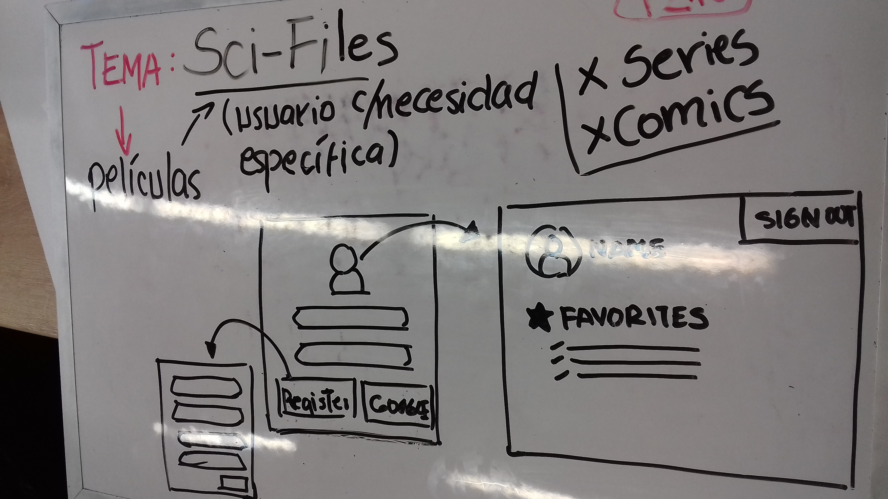

# Sci-Files // Proyecto Hackaton
___
## Día 1: Planificación e investigación

* Planificación del proyecto: Dentro del tema en si sobre la información de videos, ¿A que publico del mundo del cine queremos ir?
Por el momento se tiene planeado ir por la tematica de las peliculas de heroes y villanos. Especialmente del mundo de DC y Marvel. holi

* Cosas a utilizar: 
	1. Framework: Bootstrap 4
	2. jQuery
	3. API OMDB/Pensando en usar otra o agregar otra

* Realizando: Avance del boceto del Mockup de la pagina y posible maquetación basica para guía.

* Cosas propuestas: Investigar a posibles usuarios que lo utilizaran(incluye pequeña entrevista con preguntas breves).

* Por la tarde investigación de la API. 

## Día 2: Cambios y manos a la obra

* Al encontrar el Día 1 un problema con la API decimos investigar y hoy se mostraron soluciones posibles de como corregir este error, por ahora estamos proponiendo poner una hora para probar la solución.

* Al descubrir una forma de filtrar decidimos cambiar el tema y el problema por SCI-FI, y concretando con el nombre de Sci-Files.

* Realización de maquetado propuesto y final.

## Día 3: Avanzando el maquetado y funcionalidad

* Avanzando con el maquetado principal y las views, funcionalidad de filtrado por Sci-Fi.

* Validación de usuario por Google, registro de correo y contraseña dentro de firebase.

## Día 4: Preparación, entrega y exposición

